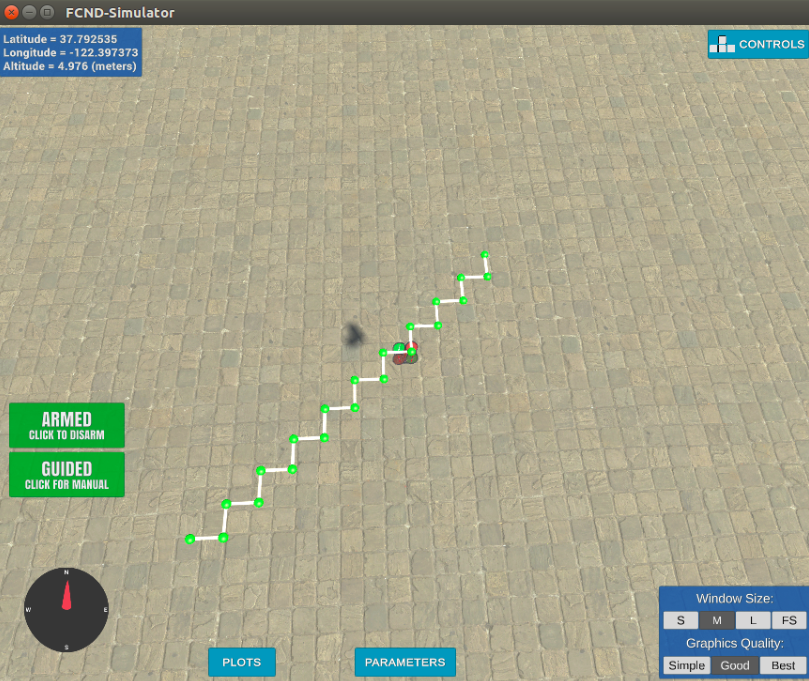

# FCND-Motion-Planning
2nd Project - 3D Motion Planning 


## Explaning the Starter Code


---

* 1- Read Global Home , Global Position and Local Position
```
print('global home {0}, position {1}, local position {2}'.format(self.global_home, self.global_position,
                                                                         self.local_position))
```
* 2- Read "Collider.csv" file and obtaining obstacle in the map
```
data = np.loadtxt('colliders.csv', delimiter=',', dtype='Float64', skiprows=2)
```    
* 3- Creat Grid with a particular altitude and safety margin around obstacles via Planning_utils.py 
```
grid, north_offset, east_offset = create_grid(data, TARGET_ALTITUDE, SAFETY_DISTANCE)

```  
      * a-Find North_min , North_max , East_min and East_max
      * b-Find Nort and East Size 
      * c-Creat a zero grid array by using Nort and East Size  
      * d-Find obstacles and insert into the grid array
  
* 4- Define Start and Goal Point
```    
 grid_start = (-north_offset, -east_offset)
       
 grid_goal = (-north_offset + 10, -east_offset + 10)
```
* 5- Run A* Search Algorithm to find parth via Planning_utils.py
```    
  path, _ = a_star(grid, heuristic, grid_start, grid_goal)
```
* 6- Create Waypoint List by using Path which is found by A* Search Algorithm ( Step 5 )
```    
   waypoints = [[p[0] + north_offset, p[1] + east_offset, TARGET_ALTITUDE, 0] for p in path]
```
* 7- Send Waypoint List to Waypoint Array
```    
  self.waypoints = waypoints
```
* 8- Send Waypoint List to Simulator
```    
  self.send_waypoints()
```
---

## Implementing Path Planning Algorithm

#### 1. Set your global home position

 * a - Read "collider.csv" file and assign a 'read_pos' string array 
 * b - Remove ',' --> [ lat0 37.792480 lon0 -122.397450 ]
 * c - Split String --> [ [lat0], [37.792480], [lon0], [-122.397450] ]
 * d - Assign Lon & Lat Values to self.global_home[0] & self.global_home[1]
```    
  # read file
        from itertools import islice
        filename = 'colliders.csv'  
        with open(filename) as f:
            for line in islice(f, 1):
                read_pos = line

        read_pos = read_pos.replace(",", "") # remove ','
        read_pos = read_pos.split() # split string
       
        # TODO: set home position to (lat0, lon0, 0) [Checked]
        self.global_home[0] = float(read_pos[3]) # lon  
        self.global_home[1] = float(read_pos[1]) # lat
        self.global_home[2] = 0
```
#### 2. Set your current local position
Here as long as you successfully determine your local position relative to global home you'll be all set. Explain briefly how you accomplished this in your code.


Meanwhile, here's a picture of me flying through the trees!


#### 3. Set grid start position from local position
This is another step in adding flexibility to the start location. As long as it works you're good to go!

#### 4. Set grid goal position from geodetic coords
This step is to add flexibility to the desired goal location. Should be able to choose any (lat, lon) within the map and have it rendered to a goal location on the grid.

#### 5. Modify A* to include diagonal motion (or replace A* altogether)
Minimal requirement here is to modify the code in planning_utils() to update the A* implementation to include diagonal motions on the grid that have a cost of sqrt(2), but more creative solutions are welcome. Explain the code you used to accomplish this step.

#### 6. Cull waypoints 
For this step you can use a collinearity test or ray tracing method like Bresenham. The idea is simply to prune your path of unnecessary waypoints. Explain the code you used to accomplish this step.

