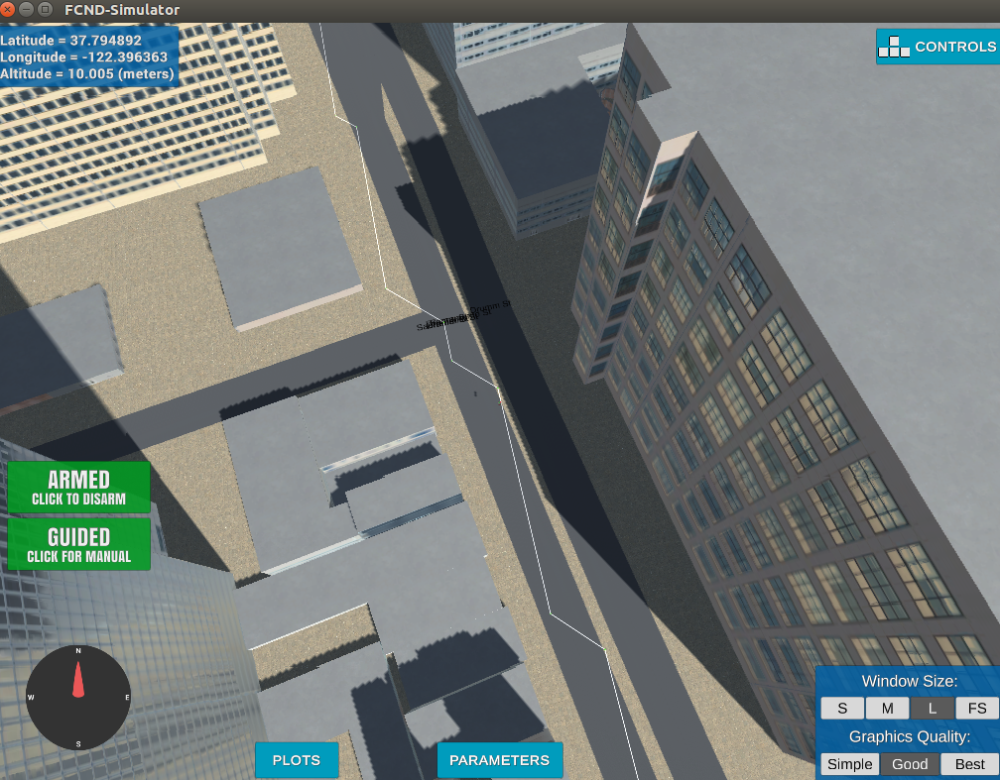
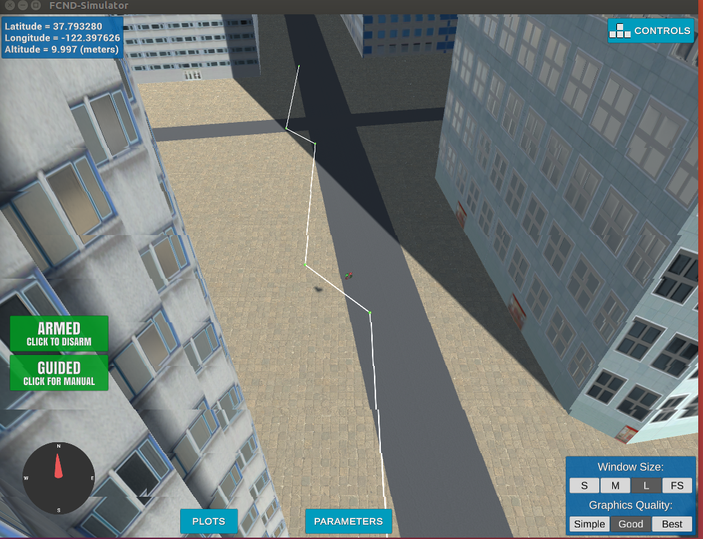

# FCND-Motion-Planning
2nd Project - 3D Motion Planning 


## Explaning the Starter Code


---

* 1- Read Global Home , Global Position and Local Position
```
print('global home {0}, position {1}, local position {2}'.format(self.global_home, self.global_position,
                                                                         self.local_position))
```
* 2- Read "Collider.csv" file and obtaining obstacle in the map
```
data = np.loadtxt('colliders.csv', delimiter=',', dtype='Float64', skiprows=2)
```    
* 3- Creat Grid with a particular altitude and safety margin around obstacles via Planning_utils.py 
```
grid, north_offset, east_offset = create_grid(data, TARGET_ALTITUDE, SAFETY_DISTANCE)

```  
      * a-Find North_min , North_max , East_min and East_max
      * b-Find Nort and East Size 
      * c-Creat a zero grid array by using Nort and East Size  
      * d-Find obstacles and insert into the grid array
  
* 4- Define Start and Goal Point
```    
 grid_start = (-north_offset, -east_offset)
       
 grid_goal = (-north_offset + 10, -east_offset + 10)
```
* 5- Run A* Search Algorithm to find parth via Planning_utils.py
```    
  path, _ = a_star(grid, heuristic, grid_start, grid_goal)
```
* 6- Create Waypoint List by using Path which is found by A* Search Algorithm ( Step 5 )
```    
   waypoints = [[p[0] + north_offset, p[1] + east_offset, TARGET_ALTITUDE, 0] for p in path]
```
* 7- Send Waypoint List to Waypoint Array
```    
  self.waypoints = waypoints
```
* 8- Send Waypoint List to Simulator
```    
  self.send_waypoints()
```
---

## Implementing Path Planning Algorithm

#### 1. Set your global home position

 * a - Read "collider.csv" file and assign a 'read_pos' string array --> --> [ lat0 37.792480, lon0 -122.397450 ]
 * b - Remove ',' --> [ lat0 37.792480 lon0 -122.397450 ]
 * c - Split String --> [ [lat0], [37.792480], [lon0], [-122.397450] ]
 * d - Assign Lon & Lat Values to self.global_home[0] & self.global_home[1]
```    
  # read file
        from itertools import islice
        filename = 'colliders.csv'  
        with open(filename) as f:
            for line in islice(f, 1):
                read_pos = line

        read_pos = read_pos.replace(",", "") # remove ','
        read_pos = read_pos.split() # split string
       
        self.global_home[0] = float(read_pos[3]) # lon  
        self.global_home[1] = float(read_pos[1]) # lat
        self.global_home[2] = 0
```
#### 2. Set your current local position


```    
  current_local_position = []
  current_local_position = global_to_local (self.global_position, self.global_home)
```


#### 3. Set grid start position from local position

```    
        north_start = int(current_local_position[0])
        easth_start = int(current_local_position[1])

        grid_start = ( (north_start + -north_offset) , (easth_start + -east_offset) )

        print("north_start:",north_start,"easth_start:",easth_start)
        print ("Grid_Start:",grid_start)
```

#### 4. Set grid goal position from geodetic coords

```     #Goal One
        goal_lon = -122.397745 # Desired Goal Position's Longtitude
        goal_lat =  37.793837  # Desired Goal Position's Latitude
        
        goal_pos_global = []
        goal_pos_global = [ goal_lon , goal_lat , 0]

        goal_pos_local = []       
        goal_pos_local = global_to_local (goal_pos_global,self.global_home)
         
        north_goal = int(goal_pos_local[0])
        easth_goal = int(goal_pos_local[1])
        
        grid_goal = ( ( north_goal + -north_offset )  , (easth_goal + -east_offset) )
       
        print("north_stop:",north_goal,"easth_start:",easth_goal)
        print ("Grid_Goal:",grid_goal)
```

#### 5. Modify A* to include diagonal motion (or replace A* altogether)

### planing_utils_sol.py 

Add Diagonal Motion Cost into Action class
```  
    NORTH_WEST = (-1, -1, np.sqrt(2))
    NORTH_EAST = (-1, 1, np.sqrt(2))
    SOUTH_WEST = (1, -1, np.sqrt(2))
    SOUTH_EAST = (1, 1, np.sqrt(2))
        
```  

Also Check Obstacle for Diagonal Motion
```  
    if (x - 1 < 0 or y - 1 < 0) or grid[x - 1, y - 1] == 1:
        valid_actions.remove(Action.NORTH_WEST)
    if (x - 1 < 0 or y + 1 > m) or grid[x - 1, y + 1] == 1:
        valid_actions.remove(Action.NORTH_EAST)
    if (x + 1 > n or y - 1 < 0) or grid[x + 1, y - 1] == 1:
        valid_actions.remove(Action.SOUTH_WEST)
    if (x + 1 > n or y + 1 > m) or grid[x + 1, y + 1] == 1:
        valid_actions.remove(Action.SOUTH_EAST)
        
``` 

#### 6. Cull waypoints 

motion_planning_sol.py
```     
        from planning_utils import prune_path
        pruned_path = prune_path(path) # path prune

        # Convert path to waypoints
        waypoints = [[p[0] + north_offset, p[1] + east_offset, TARGET_ALTITUDE, 0] for p in pruned_path]
        
```
planing_utils.py
``` 
    def prune_path(path):
      pruned_path = [p for p in path]
    
      i = 0
      while i < len(pruned_path) - 2:
        p1 = point(pruned_path[i])
        p2 = point(pruned_path[i+1])
        p3 = point(pruned_path[i+2])
        
      
        if collinearity_check(p1, p2, p3):
            pruned_path.remove(pruned_path[i+1])
        else:
            i += 1
    return pruned_path

  def point(p):
    return np.array([p[0], p[1], 1.]).reshape(1, -1)

  def collinearity_check(p1, p2, p3, epsilon=1e-4):   
    m = np.concatenate((p1, p2, p3), 0)
    det = np.linalg.det(m)
    return abs(det) < epsilon
    
```
### Execute the flight



---




